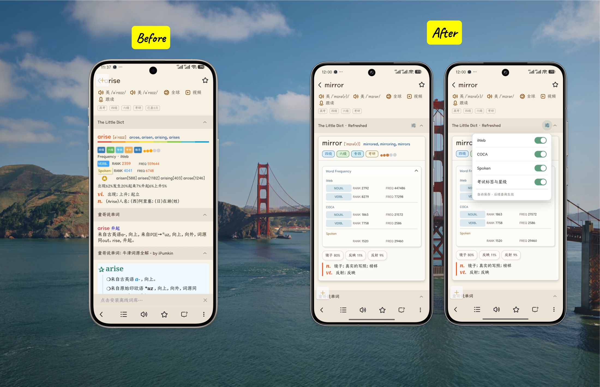
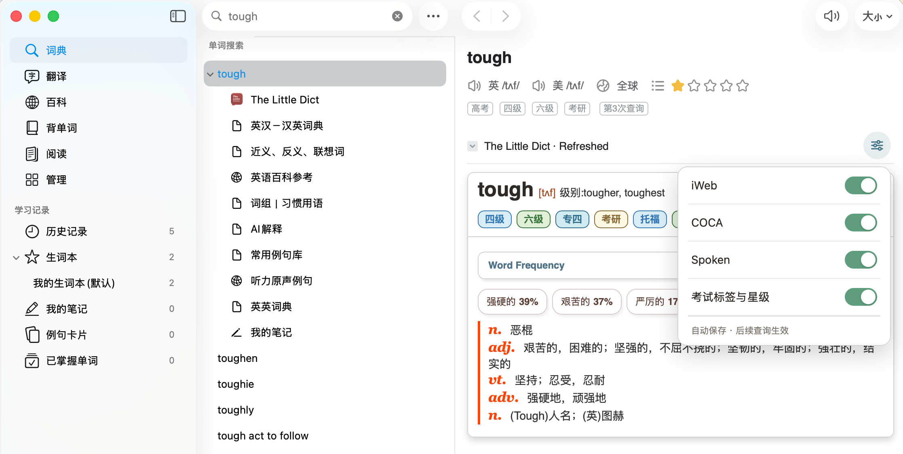
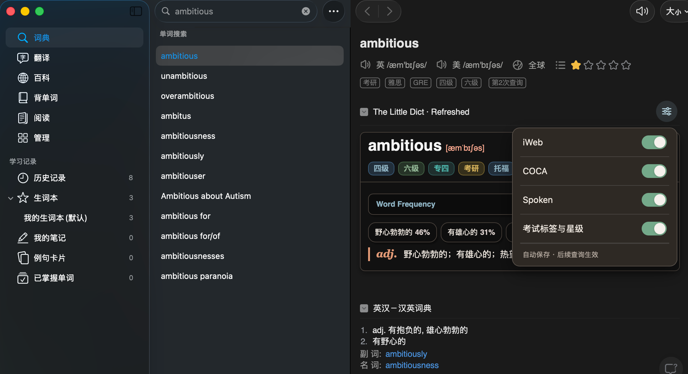
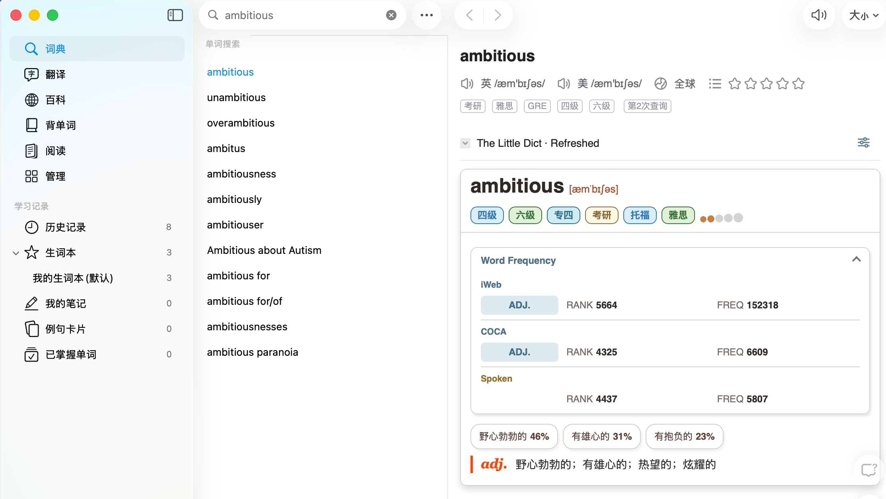
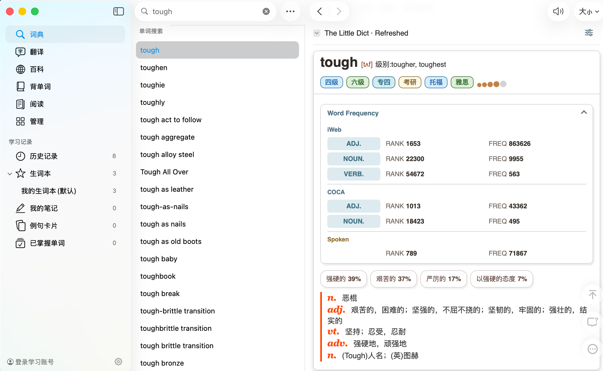
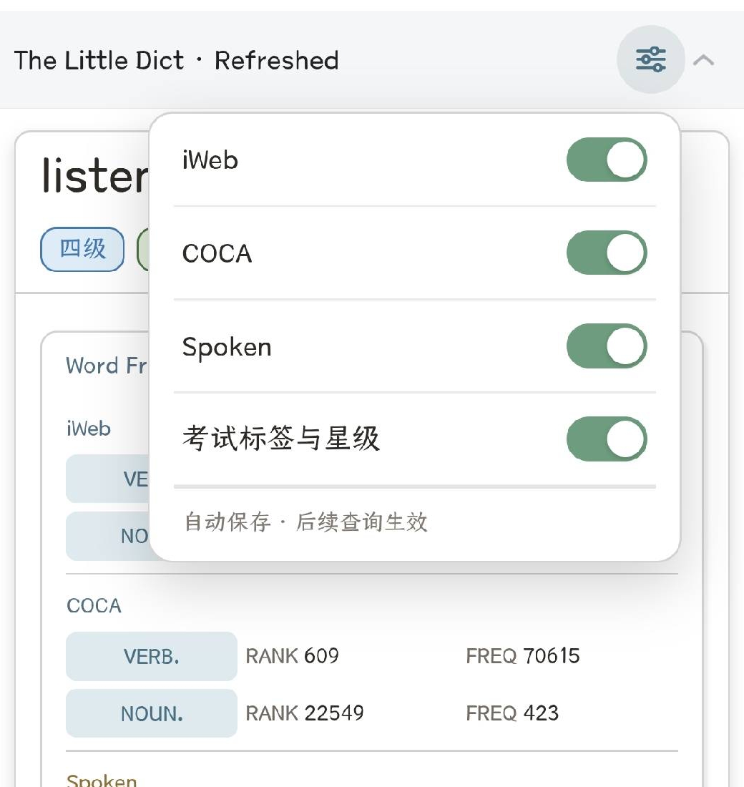
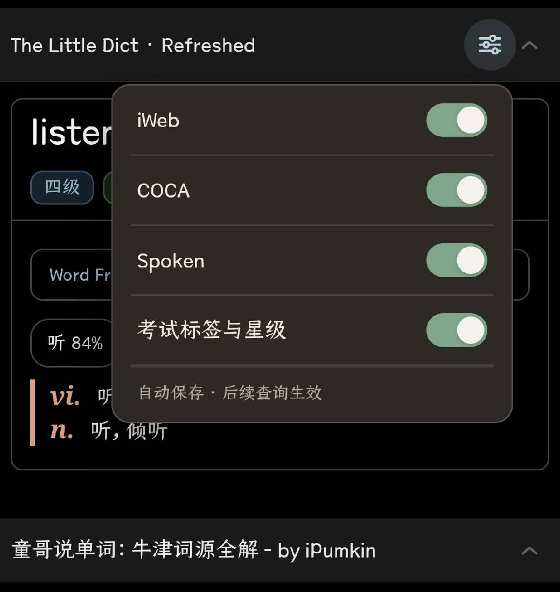

<p align="center">
  
</p>

<p align="center">
  <strong>v0.2.1 · 桌面兼容更新</strong><br>
  面向欧路词典移动端与桌面端的稳定查询与显示控制
</p>

The Little Dict · Refreshed 在不修改词典正文与原始词频数据的前提下，重新整理单词、短语、词频来源与中文释义，并允许按需显示 iWeb、COCA、Spoken、Phrase Frequency、考试标签与星级。设置自动保存，让后续查询在移动端、桌面端、深色模式和动态加载场景中保持清晰、稳定。

## 实机效果

以下均为欧路词典中的真实运行效果，没有重新生成或重绘界面文字。v0.2.0 完整包已在 Android 与 iOS 实机稳定运行；v0.2.1 进一步通过 macOS 欧路桌面端验收。

### 改造前后

<p align="center">
  <a href="./assets/readme/screenshots/comparison/mobile-before-after.jpg"></a>
</p>

<p align="center"><sub>左：原始展示　·　右：Refreshed 词频卡片与页面显示设置（点击图片查看原尺寸）</sub></p>

### macOS 桌面端

<p align="center">
  <a href="./assets/readme/screenshots/macos/settings-light.png"></a>
  <a href="./assets/readme/screenshots/macos/settings-dark.png"></a>
</p>

<p align="center"><sub>左：浅色模式　·　右：深色模式（点击图片查看原尺寸）</sub></p>

<details>
<summary>查看更多 macOS 浅色模式词频效果</summary>

<p align="center">
  <a href="./assets/readme/screenshots/macos/word-frequency-light.png"></a>
  <a href="./assets/readme/screenshots/macos/word-frequency-multi-pos-light.png"></a>
</p>

<p align="center"><sub>左：单一词性词频　·　右：多词性词频</sub></p>

</details>

### 移动端页面显示设置

<p align="center">
  <a href="./assets/readme/screenshots/settings-light.png"></a>
  <a href="./assets/readme/screenshots/settings-dark.png"></a>
</p>

<p align="center"><sub>左：浅色模式　·　右：深色模式（点击图片查看原尺寸）</sub></p>

### 移动端单词查询

<p align="center">
  <a href="./assets/readme/screenshots/listen-light.png"></a>
  <a href="./assets/readme/screenshots/listen-dark.png"></a>
</p>

<p align="center"><sub>左：浅色模式　·　右：深色模式（点击图片查看原尺寸）</sub></p>

### 移动端短语与相邻同形词查询

<p align="center">
  <a href="./assets/readme/screenshots/go-on-light.png"></a>
  <a href="./assets/readme/screenshots/go-on-dark.png"></a>
</p>

<p align="center"><sub>左：浅色模式　·　右：深色模式（点击图片查看原尺寸）</sub></p>

## v0.2.1 包含什么

- 单词词频统一为 `iWeb → COCA → Spoken` 三来源卡片；
- 短语保留 `RANK`、`freq.`、`dict.`、`cmpt.` 与 `spoken` 数据；
- Phrase Frequency 与相邻同形词的 Word Frequency 分开呈现；
- 隐藏卡片内的词性占比条，保留卡片下方的释义占比胶囊；
- 可独立控制 iWeb、COCA、Spoken、Phrase Frequency、考试标签与星级；
- 当前查询没有对应内容时自动省略设置项，修改后立即生效并自动保存；
- 设置浮层保持在视口内，点击页面其他位置即可关闭；
- 兼容 macOS 欧路桌面端的词典标题与折叠结构，桌面端也可使用页面显示设置；
- 适配 320–720 CSS px、浅色模式与深色模式。

## 安装

> 仓库不直接保存 `TLD.mdx`。请从项目的 [Releases](https://github.com/M3tar/The_Little_Dict_Refreshed/releases) 页面下载完整词典包，不要下载 GitHub 自动生成的 Source code ZIP。

1. 在 Releases 页面下载 `TLD_Refreshed_v0.2.1.zip`；
2. 解压并确认其中包含 `TLD.mdx`、`TLD.png`、`config.ini`、`fy.js` 和 `p.css`；
3. 在欧路词典中导入 `TLD.mdx`，并确保其他配套文件与其位于同一目录；
4. 查询 `listen` 和 `go on`，确认 Word Frequency 与 Phrase Frequency 正常显示。

### 为什么仓库中没有 TLD.mdx？

`TLD.mdx` 体积较大，不适合加入 Git 历史。稳定版本通过 GitHub Release 提供包含词典正文和配套界面文件的完整安装包。

若更新后仍看到旧样式或没有设置按钮，请先清除欧路词典缓存并重新打开词典；移动端仍未刷新时再强制停止应用，必要时删除旧词典后重新导入。请勿把“清除数据/清除存储空间”作为常规步骤。

## 显示配置

`config.ini` 提供首次导入时的默认显示设置。页面设置保存偏好后，`iweb`、`coca`、`spoken`、`EPFD` 和 `exam` 的已保存值优先于这里的默认值。

| 配置项 | 默认值 | 作用 |
| --- | ---: | --- |
| `freq_expand` | `0` | Word Frequency 默认折叠；`1` 展开，`2` 隐藏 |
| `phrase_freq_expand` | `0` | Phrase Frequency 默认折叠；`1` 展开 |
| `iweb` | `1` | 显示 iWeb 来源 |
| `coca` | `1` | 显示 COCA 来源 |
| `spoken` | `1` | 显示 Spoken 来源 |
| `EPFD` | `1` | 显示 Phrase Frequency |
| `exam` | `1` | 显示考试标签与柯林斯星级 |
| `ex_ratio` | `1` | 显示卡片下方的释义占比胶囊 |
| `definition` | `1` | 显示按词性分组的中文释义 |
| `dark_mode` | `0` | 跟随宿主；`1` 浅色，`2` 深色 |

完整说明见 [`config.ini`](./config.ini)。

## 项目文件

```text
TLD.mdx       完整发布包中的词典正文（不纳入 Git 仓库）
TLD.png       词典图标
config.ini    默认显示配置
fy.js         DOM 解析、重组与交互
p.css         布局、主题与响应式样式
```

`TLD.mdx` 和完整发布包体积较大，不作为普通 Git 文件提交。公开分发前还需单独确认词典正文的授权范围。

## 验证状态

- Android 与 iOS 实机：v0.2.0 完整包均可稳定运行；Android 已核对浅色、深色、单词、短语、相邻同形词及页面显示设置；
- macOS 欧路桌面端：与 v0.2.1 正式源码一致的 b08 测试构建已通过标题、折叠、设置入口、五项开关、外部点击关闭与偏好持久化验收；
- 本地 Chromium：v0.2.1 正式源码 40 组回归通过，桌面标题、混合缓存定位、透明外部点击层和折叠浮层专项通过；
- 覆盖宽度：320、360、375、390、430、720 CSS px；
- 正式包：不含测试编号，包内资源与已验收源码一致。

## 路线图

**0.2.1 · 桌面兼容更新（当前版本）**

兼容 macOS 欧路桌面端的标题结构，使页面显示设置在移动端与桌面端均可正常使用。

**0.2.0 · 可配置查询版**

在 0.1.0 的稳定查询基础上，加入五项独立显示开关、内容感知设置项、自动保存与浮层交互。

**0.1.0 · 稳定查询版**

完成单词、短语、三来源词频、相邻同形词、释义占比胶囊及响应式深色模式的稳定显示。

**下一阶段**

尚未定义。后续功能会继续以不修改词典正文和原始词频数据为前提，并在开发前单独确认范围。

## 开发约束

项目不修改词典释义、词频原始数值或语料统计口径。`fy.js` 负责稳定渲染与交互，`p.css` 负责布局和主题，`config.ini` 只提供默认开关值。
