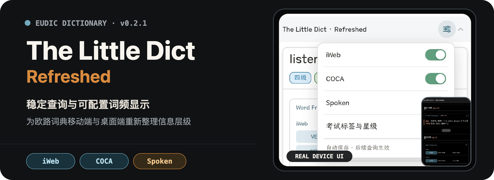
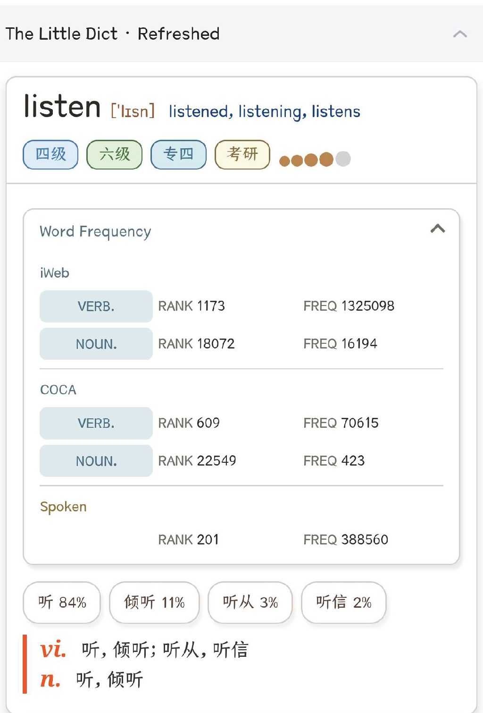
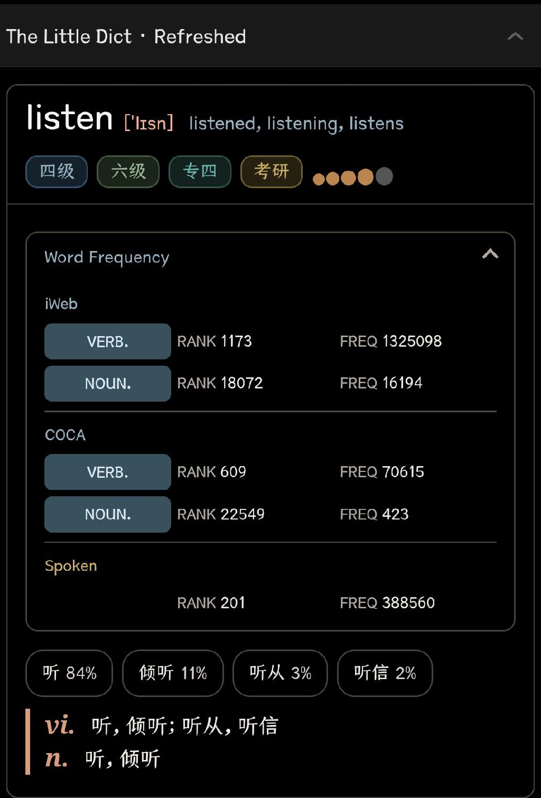
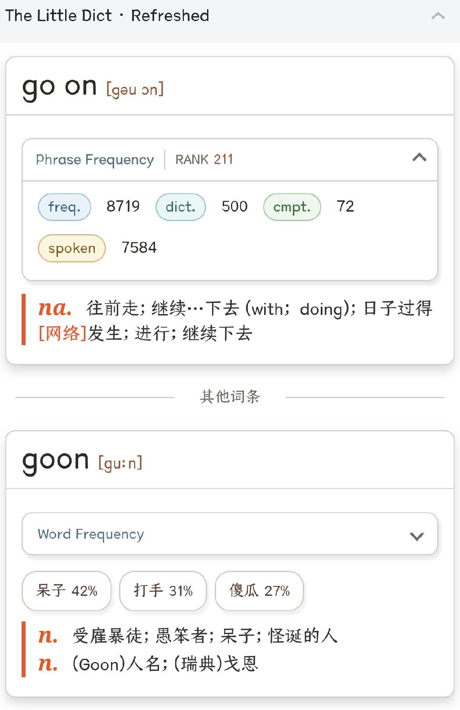
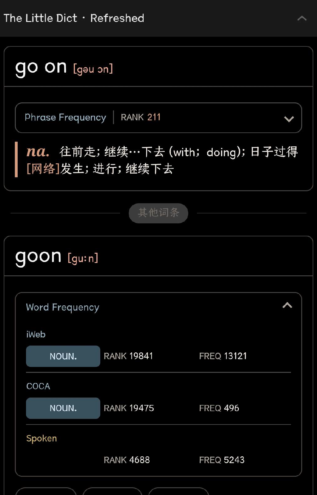

<p align="center">
  
</p>

<p align="center">
  <strong>v0.1.0 · 稳定查询版</strong><br>
  面向欧路词典移动端的稳定查询显示层
</p>

The Little Dict · Refreshed 在不修改词典正文与原始词频数据的前提下，重新整理单词、短语、词频来源与中文释义，让查询结果在手机、深色模式和动态加载场景中保持清晰、稳定。

## 实机效果

以下截图来自 Android 实机，仅裁去状态栏、宿主工具栏和其他词典内容，没有重新生成或重绘界面文字。

### 单词查询

<p align="center">
  <a href="./assets/readme/screenshots/listen-light.png"></a>
  <a href="./assets/readme/screenshots/listen-dark.png"></a>
</p>

<p align="center"><sub>左：浅色模式　·　右：深色模式（点击图片查看原尺寸）</sub></p>

### 短语与相邻同形词查询

<p align="center">
  <a href="./assets/readme/screenshots/go-on-light.png"></a>
  <a href="./assets/readme/screenshots/go-on-dark.png"></a>
</p>

<p align="center"><sub>左：浅色模式　·　右：深色模式（点击图片查看原尺寸）</sub></p>

## 0.1.0 包含什么

- 单词词频统一为 `iWeb → COCA → Spoken` 三来源卡片；
- 短语保留 `RANK`、`freq.`、`dict.`、`cmpt.` 与 `spoken` 数据；
- Phrase Frequency 与相邻同形词的 Word Frequency 分开呈现；
- 隐藏卡片内的词性占比条，保留卡片下方的释义占比胶囊；
- 支持多词性、缺失来源、长数值和动态追加词条；
- 适配 320–720 CSS px、浅色模式与深色模式。

## 安装

> 仓库不直接保存 `TLD.mdx`。请从项目的 [Releases](https://github.com/M3tar/The_Little_Dict_Refreshed/releases) 页面下载完整词典包，不要下载 GitHub 自动生成的 Source code ZIP。

1. 在 Releases 页面下载 `TLD_Refreshed_v0.1.0_Android.zip`；
2. 解压并确认其中包含 `TLD.mdx`、`TLD.png`、`config.ini`、`fy.js` 和 `p.css`；
3. 在欧路词典中导入 `TLD.mdx`，并确保其他配套文件与其位于同一目录；
4. 查询 `listen` 和 `go on`，确认 Word Frequency 与 Phrase Frequency 正常显示。

### 为什么仓库中没有 TLD.mdx？

`TLD.mdx` 体积较大，不适合加入 Git 历史。稳定版本通过 GitHub Release 提供包含词典正文和配套界面文件的完整安装包。

若仍看到旧样式，可先清除欧路词典缓存并强制停止应用，再删除旧词典后重新导入。请勿把“清除数据/清除存储空间”作为常规步骤。

## 显示配置

`config.ini` 提供首次导入时的默认显示设置。第二阶段页面设置保存偏好后，`iweb`、`coca`、`spoken`、`EPFD` 和 `exam` 的已保存值优先于这里的默认值。

| 配置项 | 默认值 | 作用 |
| --- | ---: | --- |
| `freq_expand` | `0` | Word Frequency 默认折叠；`1` 展开，`2` 隐藏 |
| `phrase_freq_expand` | `0` | Phrase Frequency 默认折叠；`1` 展开 |
| `iweb` | `1` | 显示 iWeb 来源 |
| `coca` | `1` | 显示 COCA 来源 |
| `spoken` | `1` | 显示 Spoken 来源 |
| `EPFD` | `1` | 显示 Phrase Frequency |
| `exam` | `1` | 显示考试标签与柯林斯星级 |
| `ex_ratio` | `1` | 显示卡片下方的释义占比胶囊 |
| `definition` | `1` | 显示按词性分组的中文释义 |
| `dark_mode` | `0` | 跟随宿主；`1` 浅色，`2` 深色 |

完整说明见 [`config.ini`](./config.ini)。

## 项目文件

```text
TLD.mdx       完整发布包中的词典正文（不纳入 Git 仓库）
TLD.png       词典图标
config.ini    默认显示配置
fy.js         DOM 解析、重组与交互
p.css         布局、主题与响应式样式
```

`TLD.mdx` 和完整发布包体积较大，不作为普通 Git 文件提交。公开分发前还需单独确认词典正文的授权范围。

## 验证状态

- Android 实机：0.1.0 核心查询界面已验收；第二阶段 b04 发现混合缓存问题，b05 等待实机复验；
- 本地 Chromium：正式源码与 b05 测试包各 39 组回归通过，b05 混合缓存专项回归通过；
- 覆盖宽度：320、360、375、390、430、720 CSS px；
- iOS：尚未进行实机测试。

## 路线图

**0.1.0 · 稳定查询版（当前版本）**

稳定查询单词、短语和词频，不改变词典正文数据。

**下一版本 · 页面显示设置（开发中）**

- 在词典分组标题右侧提供手机友好的齿轮入口和轻量浮层；
- 独立控制 iWeb、COCA、Spoken、Phrase Frequency、考试标签与星级；
- 当前查询没有真实内容时省略对应设置项；
- 设置立即生效并自动保存到后续查询。

这一阶段只控制 0.1.0 已稳定模块的显隐，不重新设计词频数据结构；暂不加入简洁模式、页面内恢复默认入口，也不控制卡片下方的释义占比胶囊。

## 开发约束

项目不修改词典释义、词频原始数值或语料统计口径。`fy.js` 负责稳定渲染与交互，`p.css` 负责布局和主题，`config.ini` 只提供默认开关值。
